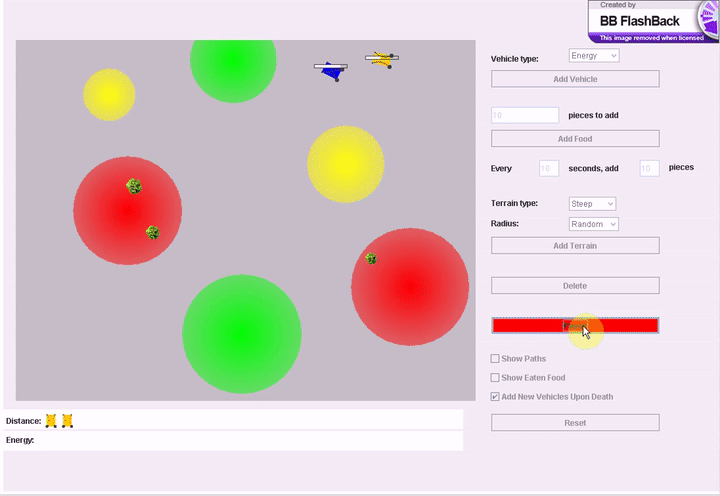

# bioenergetic-simulation
Simulation of bioenergetic- vs distance-scaling robots on autonomous navigation

Further information on topic: http://faculty.virginia.edu/perlab/bioenergetic_sim/vehicles.html
Description of simulation: http://faculty.virginia.edu/perlab/bioenergetic_sim/description.html
